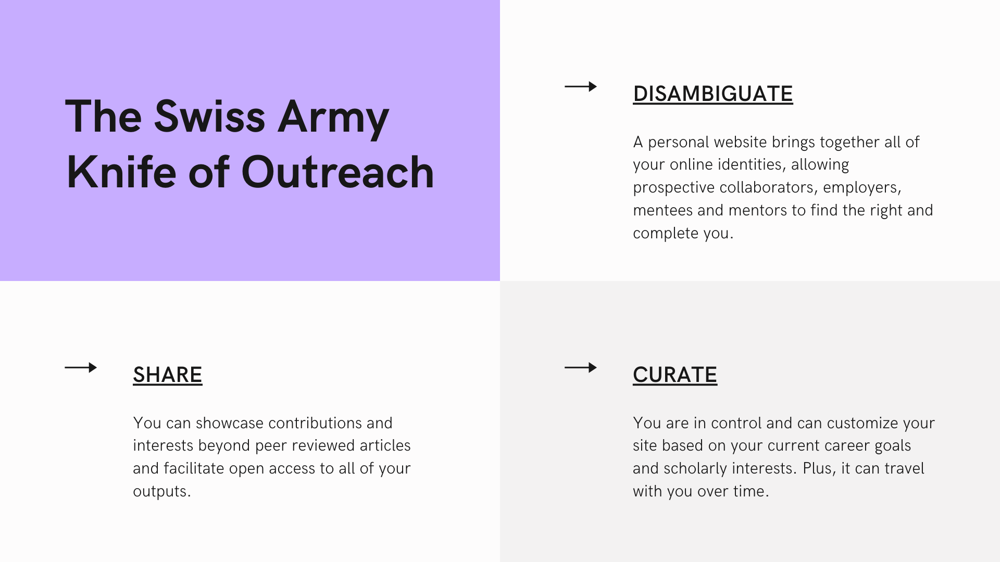
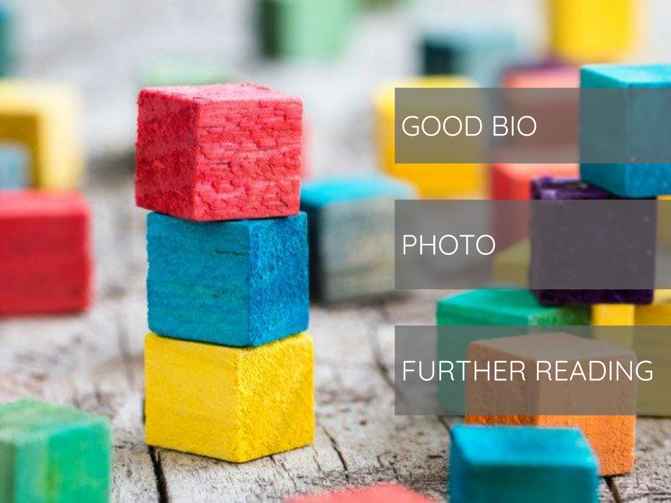

# A Personal Website for Professional Outreach

A personal website can serve as a flexible hub for describing your interests and expertise, and sharing your scholarly contributions, including articles, code, posters and instructional materials.  This workshop will walk you through the technical steps for creating a website with Github Pages and some strategies for using it effectively for professional outreach and disseminating your work.

## The Benefits of Having a Website

A personal website takes time to build and maintain, so why do it?

- Depending on where you are in your career and your social media activity, you might have several online profiles, such as on Twitter, an institutional staff or student page, ORCID and LinkedIn.  A personal website can serve as a hub that links out to and contextualizes these profiles and activities.
- It can be customized to help you achieve and reflect your current goals and interests.  
- It stays with you, regardless of where you go professionally.
- Allows you to showcase and provide access to contributions and research outputs beyond peer reviewed articles.

## What is Github Pages?

GitHub Pages is a system built into GitHub that allows you to build websites directly from a GitHub Repository.

There are three kinds of GitHub Pages websites:

- User websites (associated with a personal Github account)
- Organizational websites (associated with an organizational Github account)
- Project websites (associated with a specific project hosted on Github)

This workshop focuses on user websites.  We'll cover this in detail in the next lesson, but it is important to note that GitHub Pages user websites must be built from a repository owned by your account and named as so:  <*Github username*>.github.io.  For example, my Github username is rchampieux and the repository that builds my user website is named rchampieux.github.io.

## Why GitHub Pages?

GitHub is a highly dependable and free.  Plus, it uses Markdown, so you don't need programing skills or HTML tags to create, format or edit your website.  We'll talk more about Markdown in the third lesson.  

## What is Jekyll?

Jekyll is what's known as a static site generator and it is what Github pages uses to create a website.  Jekyll is built into GitHub, so you just need to edit the files in your repository to autommatically build your website.  You can pick one of GitHub’s pre-made themes for your website, use a free Jekyll theme, or use your own custom CSS.  In this workshop, we'll be using a free Jekyll theme for academic websites developed by the NC State University Libraries, which we'll take a closer look at in the next lesson.

The other nice thing about Jekyll is that it will integrate things like Google Analytics, tags, and search into your website structure.

## Content Building Blocks

### Bio basics

- Your bio is not your Biosketch or CV.
- Your bio is not a list of everything you’ve done.
- Your bio is a communication tool.
- Your bio tells a story of your credibility, interests, current activities, and accomplishments.
- Your bio should be concise, serving as an abstract of your professional self.

### Photo

Including a photo of yourself is definitely not required, but doing so is one way of personalizing your website.  In our opinion there are no (good) rules for choosing the right bio picture, except that it should be something that makes you feel good and conveys the information you want to communicate. You don't have to use a traditional headshot and, no, you don't have to smile!

Of course, it is important to choose an image with an original size and resolution that will look good on screen.  We don't recommend enlarging smaller images, as they are likely to look pixelated.  It's better to choose a larger image and crop or resize it as needed.

### Further Reading

Your website can also point to or make available information and materials that you want to promote and will help others understand your work and interests.  Examples include:
- Papers, posters and presentations
- Twitter profile
- CV
- ORCID profile
- Educational materials
- Data and code
- Blog posts

## Gather Your Content

In the next three lessons we will dive into the details of publishing and editing your website.  In our experience, you'll learn more and make more progress on your site by working with your own content.  Take ten minute to collect some **draft** material for your site.  Examples include:

- Existing bio
- A list of your most recent publications
- Twitter profile and handle
- ORCID
- A list of the classes you teach
- Other outputs you've authored or contributed to (e.g. posters, datasets, code, etc.)
