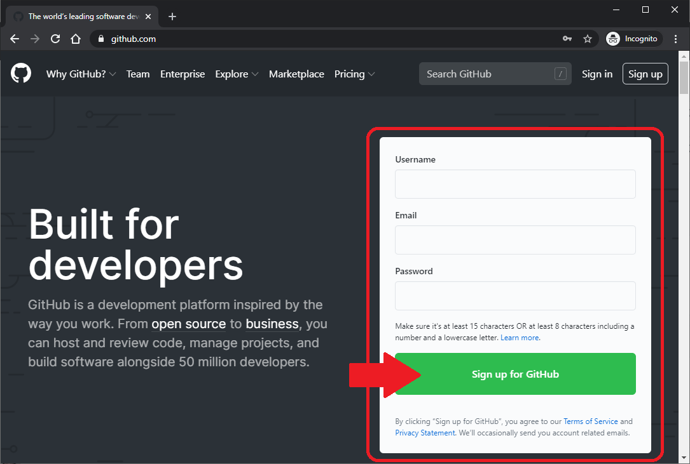
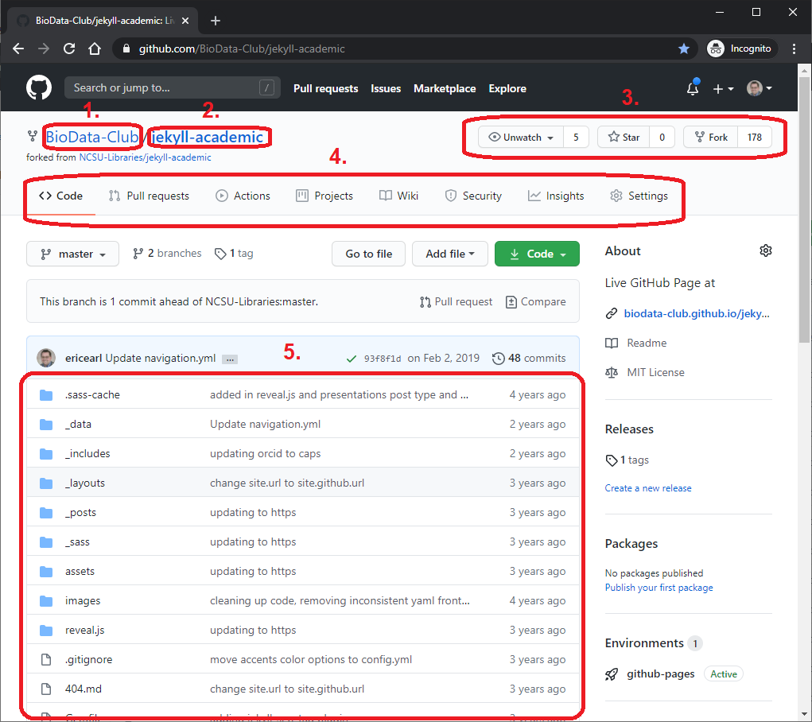
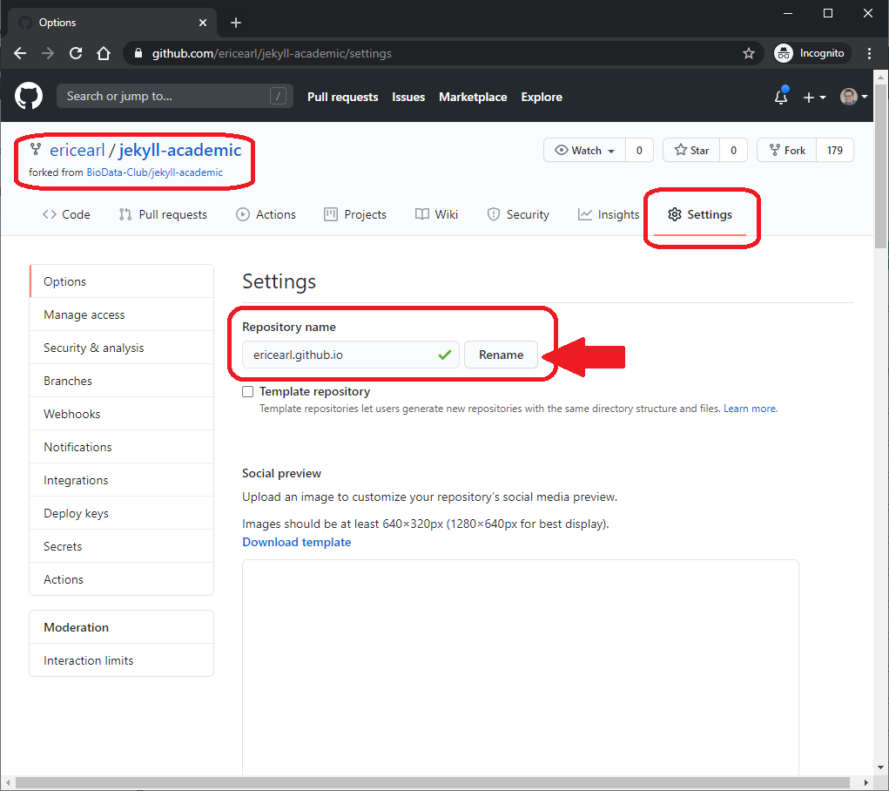
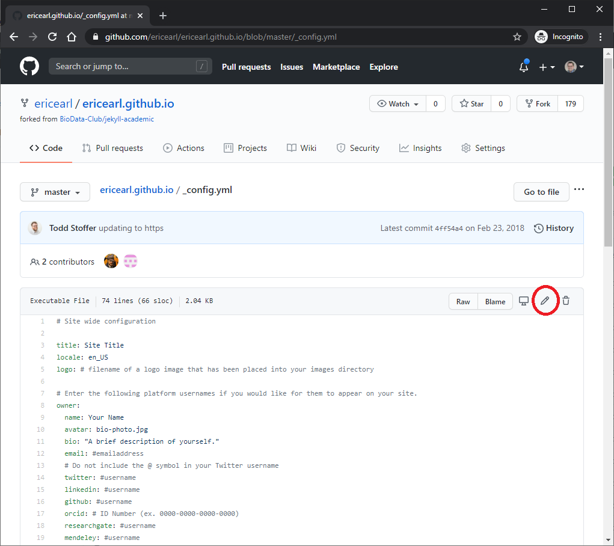
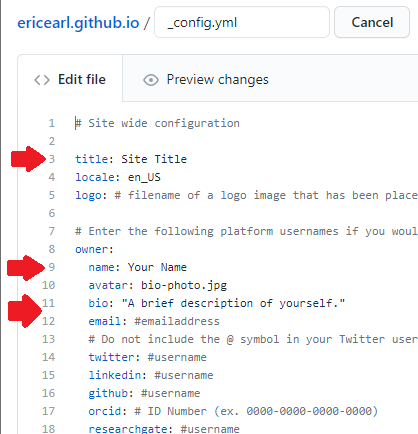
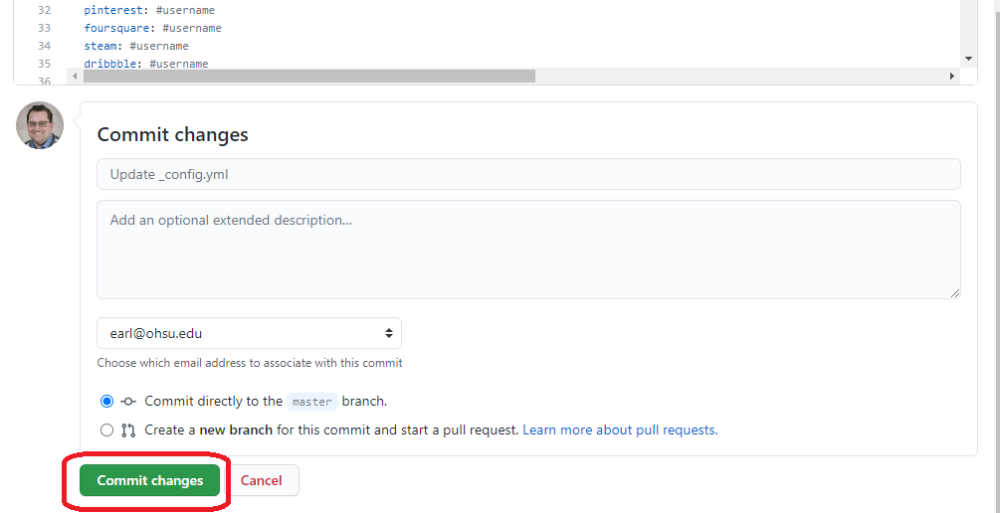

# Publishing a GitHub Page

You don't need to know how to code or know HTML to setup a GitHub Page.  We're going to build a personal webpage which will live at USERNAME.github.io.

There is a live example of the template here: [https://biodata-club.github.io/jekyll-academic/](https://biodata-club.github.io/jekyll-academic/).

## GitHub account

Skip this step if you have already setup your GitHub account

- In a web browser, navigate to [github.com](https://github.com/)
- Consider a GitHub Username that is both short and memorable, something like **firstnamelastname** is good if it is available
- Fill Out **Username**, **Email**, and **Password**
- Click **Sign up for GitHub** button
- Follow the on-screen prompts to verify your account

Make a note of the username that you create, as you will be required to use it in setting up your GitHub pages repository.

## Verify email address

- Navigate to the email account you used to sign up
- Verify your email address by clicking on the **Verify email address** button in the email you received from GitHub

## GitHub repository orientation

This is a brief section to highlight some of the features we will be using of the GitHub repository.

- Sign In to your GitHub account
- Go to the BioData Club's jekyll-academic repository: [https://github.com/BioData-Club/jekyll-academic](https://github.com/BioData-Club/jekyll-academic)

From the notated picture above:

1. Owner
2. Repository name
3. Active buttons
4. Tabs
5. Folders and files

## Fork the repository from GitHub

Forking on GitHub means you're copying a repository's files into your own repository of the same name.  You'll use the copy as the building block for your new website.

- Click the **Fork** button on the top right of the webpage's active buttons

## Rename the repository

- Click the **Settings** tab on your repository
- Change your repository name to **USERNAME.github.io** (where **USERNAME** is your exact GitHub account name)

## First edits to your webpage

Let's edit the information in the `_config.yml` YAML file.

- Back on the **Code** tab, click on the `_config.yml` YAML file
- Click on the pencil button on the top right of the preview window

This is a configuration file where important settings for your site are stored.  You'll find the `_config.yml` YAML file in the root (parent) level of your repository.

Start by updating the:

- **title** for a new website title
- **name** for your name to appear on the website
- **bio** for a short sentence version of your bio that appears below your picture
- **email** for your email to appear on the front page
- Social media fields you want (such as **twitter** or **linkedin**) for the icons to those sites to become links to your social media profiles

**Don't modify anything below** `#DO NOT EDIT BEYOND THIS POINT`.

The text to the right of any `#` symbol in a YAML file is ignored.

## Commit changes

After you have edited your `_config.yml` YAML file, click the green **Commit changes** button at the bottom of the page, which will save the file changes in your repository.  **Commit** is GitHub's way of saying **Save**.

## Look at your new website

Check out your new GitHub Page at https://USERNAME.github.io (where USERNAME is your GitHub username).  Next we will add a full bio!
