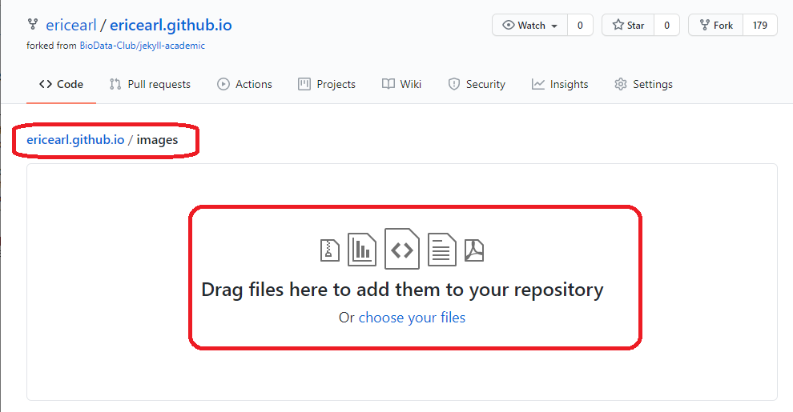
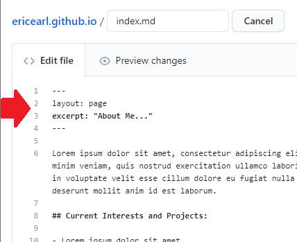

# The Magic of Markdown


Markdown is a light-weight markup language that uses an unobtrusive syntax to add formatting, such as headings and italics, to plain text documents.  It can be easily converted to many output formats, most notably HTML.

## Why is Markdown Magic?

- It makes writing for the web easy and fun!  There are many free applications that create website content from markdown files.
- Unlike HTML, it's easier to read even when you're looking at a raw file.
- There's a gentle learning curve and lots of online documentation [**like this widely used Markdown cheatsheet**](https://github.com/adam-p/markdown-here/wiki/Markdown-Cheatsheet).
- There are many use cases like:
  - Websites
  - [Documents](https://ulysses.app/)
  - [Slides](https://github.com/gnab/remark)
  - [Books](https://leanpub.com)

## The Essentials

You can create Markdown files using a text editor.  The file should have a `.md` or `.markdown` extension.  You can also use a dedicated Markdown application, like [HackMD](https://hackmd.io/) for immediately live and published content.

### Brief Syntax Primer

To create headings, add hash signs (e.g. `# The Magic of Markdown`) in front of a word or phrase.  Use one `#` for level 1 headings, use two `##` for level two headings, and so on.

The header for this section is written like this in Markdown:

```markdown
### Brief Syntax Primer
```

To bold text use two asterisks before and after a word or phrase.  

```markdown
**bold**
```

will render as:

**bold**

For italic use one asterisk before and after a word or phrase.

```markdown
*italics*
```

will render as:

*italics*

Unordered lists are can be created with asterisk `*`, plus sign `+`, or hyphen `-`.

```markdown
- October
- November
- December
```

will render as:

- October
- November
- December

To create a link, enclose the link text in brackets `[this guide]` and then follow it immediately with the URL in parentheses `(https://www.markdownguide.org/)`.  

```markdown
Content from [this guide](https://www.markdownguide.org/) was adapted for this lesson.
```

will render as:

Content from [this guide](https://www.markdownguide.org/) was adapted for this lesson.

Use one back tick around code to create in-line monospace code and three back ticks to create multi-line fenced off code blocks.

```markdown
This line has some `code` in it.
```

will render as:

This line has some `code` in it.

## Hands-on: `bio-photo.jpg` and `index.md`

Click into the `images/` folder and upload a headshot or other representative photo that is already exactly named as `bio-photo.jpg` (Click the **Add file** > **Upload files** button).  Remember to **Commit changes** to save at the bottom again.



If you upload other images into that directory you can refer to them inside your website Markdown files like this:

```markdown

```

Now check out your website again.  The picture you uploaded should have replaced the generic image we started with.

Next, your `index.md` file controls your website's front page.  You'll want to update it with your short bio and links to relevant projects and interests.  For example, take a look at [Robin's GitHub Page](https://rchampieux.github.io/) or [Eric's GitHub Page](https://ericearl.github.io/).

Try updating your bio and adding some links to your `index.md` file, such as a recently published paper or public projects.  Click the **Commit changes** button when you're done.



The first four lines are important to keep there for this particular website template.  Only edit below those four lines.

```yaml
---
layout: page
excerpt: "About Me"
---
```

## Discussion

Now that you've had some time to experiment with Markdown, what were you able to do or what did you struggle with?
