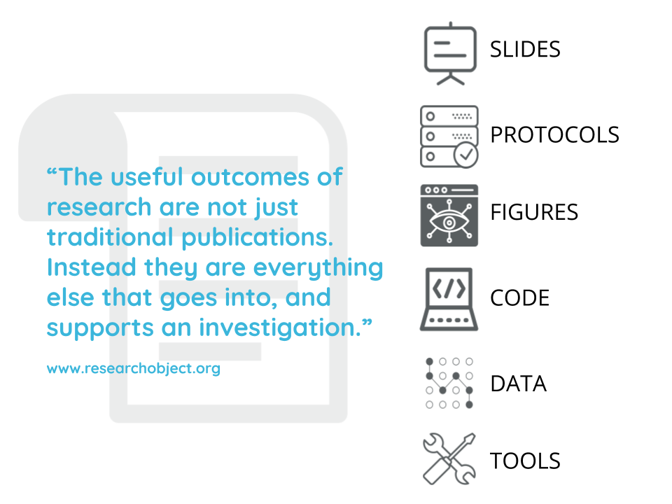

# Best Practices for Sharing Your Work
A variety of academic and research products have value and can be shared.  In this lesson we'll identify some of these products, discuss tools and best practices for sharing them, and then create a new page in your website for doing so.
## The Variety of Useful Outputs That Can be Shared

There is growing recognition of the value of sharing different kinds of scholarly products, especially those underlying scientific papers, such as datasets and code.  The scope of valuable products includes outputs that are often used to communicate early results, such as posters and conference presentations, and project workflows, such as tested protocols.  

Also, think beyond your research projects!  You've likely authored or contributed to other kinds of highly valuable and resuable work and scholarly products, such as instructional plans and materials, white papers, and advocacy resources.
## Benefits of Sharing 
Sharing your work in ways that facilitate discovery and attribution (which we'll get to next!) can lead to many benefits:

- Transparency & reproducibility
- Early credit and feedback
- Policy compliance
- Deeper enagement with your work

These outcomes are important to researchers and educators across career stages, but we want to take a moment to highlight the advantages for students and early career individuals.  Learning and applying these practices contributes to the integrity of your work and you'll gain experience with techniques and tools that funders, journals, and institutions are increasingly promoting and even requiring.  Moreover, you can share work and describe your contributions sooner and more completely than what is supported by the typical journal article publication process.  

A really good talk about the benefits of sharing your work publicly is from David Robinson, called [The Unreasonable Effectiveness of Public Work](https://rstudio.com/resources/rstudioconf-2019/the-unreasonable-effectiveness-of-public-work/).

## Best Practices and Platforms

