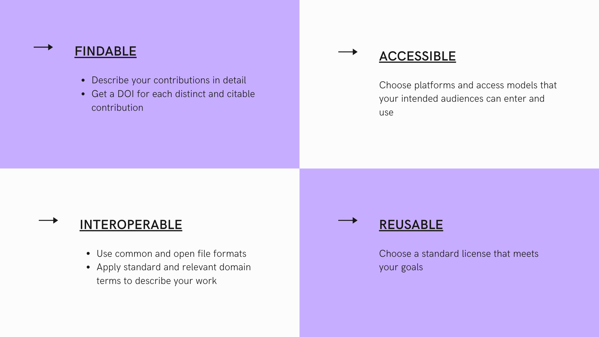

# Best Practices for Sharing Your Work
A variety of academic and research products have value and can be shared.  In this lesson we'll identify some of these products, discuss tools and best practices for sharing them, and then create a new page in your website for doing so.
## Useful Outputs That Can be Shared


There is growing recognition of the value of sharing different kinds of scholarly products, especially those underlying scientific papers, such as datasets and code.  The scope of valuable products includes those often used to communicate early results, such as posters and conference presentations, and project workflows, such as tested protocols.  

Think beyond your research projects!  You've likely authored or contributed to other kinds of highly valuable and reusable work and scholarly products, such as instructional plans and materials, white papers, and advocacy resources.
## Benefits of Sharing 
Sharing your work in ways that facilitate discovery and attribution (which we'll get to next!) can lead to many benefits:

- Transparency & reproducibility
- Early credit and feedback
- Policy compliance
- Deeper engagement with your work

These outcomes are important to researchers and educators across career stages, but we want to take a moment to highlight the advantages for students and early career individuals.  Learning and applying these practices contributes to the integrity of your work and you'll gain experience with techniques and tools that funders, journals, and institutions are increasingly promoting and even requiring.  Moreover, you can share work and describe your contributions sooner and more completely than what is supported by the typical journal article publication process.  

A really good talk about the benefits of sharing your work publicly is from David Robinson, called [The Unreasonable Effectiveness of Public Work](https://rstudio.com/resources/rstudioconf-2019/the-unreasonable-effectiveness-of-public-work/).
## Some Best Practices and Platforms
You may have heard of the phrase FAIR data, where FAIR stands for **Findable, Accessible, Interpretable and Reusable**.  FAIR data and other research objects are managed and shared in ways that realize these principles.

This lesson doesn’t dive into the details or technical specifications of making your contributions FAIR and, honestly some of that is still being debated, but FAIR is a helpful framework for guiding your publishing practices and platform options.



With these FAIR practices in mind, it's rarely prudent to host your contributions directly on your website.  Rather, choose a platform that best meets your needs and then link to what you want to share on your website, preferably with annotation.  

We recommend getting familiar and experimenting with some of the tools below.  

- [Zendo](https://zenodo.org/): An open access repository that is free to use and has robust description features.  Zenodo integrates with Github so you can archive and get a DOI for your code repositories.

- [BioRxiv]( https://www.biorxiv.org/):  A biology preprint server, on which you can share your final manuscripts in advance of a journal submission.  

- [Protocols.io]( https://www.protocols.io/):  A platform for documenting and sharing reproducible research protocols.  

Reality Check:  We're super fans of open science, but you may have publishing goals or work with collaborators that inspire questions about how to use these tools AND publish in specific journals.  A great tool for learning about a journal’s or publisher’s policies for sharing the papers you submit before and after journal publication is [Sherpa Romeo]( https://v2.sherpa.ac.uk/romeo/).  

If these tools don’t fit your needs or if you’re interested in learning more, [contact the OHSU Library]( https://ohsu.libanswers.com/).  We can help you find a tool that will and navigate the policy landscape.
## Create a New Website Page

Take a look at [Ted's site](https://laderast.github.io/).  You'll notice a menu bar with links to pages for the contributions he wants to showcase.  Your site doesn't yet include a menu or additional pages, but you can easily add both.

First, let's take a look at the files we'll be working with in the main directory of your website repository.  Pages are generated from files that end in `.md`(except `LICENSE.md` and `README.md`) and your site menu is controled by the `_data/navigation.yml` file.  

You'll probably notice that there are some `.md` files in your repository that don't yet appear on your site, such as `presentations.md`.  These are templated pages that you can update and add to your site menu, but you can also create new pages.

To create a new page that will show up in your menu bar, you need to include the following elements at the top of your .md file.  In the example below, I've titled my new page `Coursework`, but you can use a title of your choice.  

```
---
layout: page
title: Coursework
---

Text for your page goes here.
```

Try adding a new `.md` file in the main directory of your repository by pasting the text above and then writing some content. You can add some bullets by using the + symbol like this:

```
+ Data Visualization
+ Statistics
+ Social Determinants of Health
```

Which will show up like this:

+ Data Visualization
+ Statistics
+ Social Determinants of Health
## Update Your Website Menu
Now we need to edit the `_data/navigation.yml` file to update your site menu, which currently looks like this:

```
# Site navigation links
- title: Home
  url: /

#- title: Presentations
#  url: /presentations/

#- title: Resume
#  url: /resume/

#- title: Blog
#  url: /blog/
  
```
Note, the file currently includes the syntax needed to add several pages to your menu bar built on the templated `.md` files in your repository.  However, the `#` at the start of the title and URL lines turns this code into comments, so these menu items are not appearing on your site.  To add one of these pages, simply edit the file to delete the `#` at the start of the title and url lines and commit your changes.

To include the new `.md` file you created in the last step add another `title`/`url` entry.  I named my file `coursework.md`, so the `url` will be `/coursework/`. **Make sure that you start the title line with `-`**.

```
# Site navigation links
- title: Home
  url: /
  
- title: Coursework
  url: /coursework/

#- title: Presentations
#  url: /presentations/

#- title: Resume
#  url: /resume/

#- title: Blog
#  url: /blog/
```

When you're done, commit and load your website again. Confirm that your new page shows up in the menu bar. Neat!
